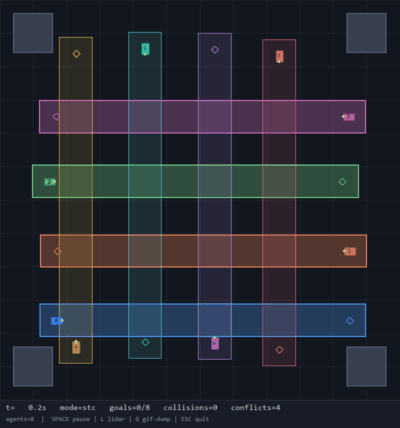

# Spatio-Temporal Corridor Multi-Agent Coordination

**Decentralized Multi-Vehicle Coordination using Spatio-Temporal Corridors (2D)**

[](https://www.python.org/downloads/)
[](LICENSE)

---

## What is this?

This is a research prototype that helps a small fleet of **4 to 8 ground vehicles**
move through a shared workspace at the same time — **safely and without bumping
into each other**.

Instead of relying on a central brain that plans every robot's path, each vehicle
is given an **exclusive slice of space and time** called a *Spatio-Temporal
Corridor* (STC): a rectangular region in `(x, y, t)` reserved only for it. As
long as every vehicle stays inside its own corridor, collisions become impossible
by construction — no matter how cramped or crossed the traffic gets.

The same codebase also includes a **single-vehicle baseline** — a classic
*master's-level foundation* where one robot uses ray-casting LiDAR, avoids
obstacles, and reaches its goal on its own. Everything on the multi-agent layer
builds directly on top of this foundation.

> **Sounds interesting?** Watch a 6-vehicle run below, then jump to
> [Getting started](#getting-started).

---

## Table of contents

- [A quick demo](#a-quick-demo)
- [What can it do?](#what-can-it-do)
- [How it works](#how-it-works)
- [Project structure](#project-structure)
- [Getting started](#getting-started)
- [Usage](#usage)
- [Running experiments](#running-experiments)
- [Results](#results)
- [Performance metrics](#performance-metrics)
- [Future work](#future-work)
- [Documentation](#documentation)
- [License](#license)

---

## A quick demo



*Eight vehicles negotiating perpendicular lanes. The semi-transparent rectangles
are their reserved corridors; the colored blocks are the vehicles themselves.*

Check the other scenarios in the `results/` folder, or press **SPACE** in the
interactive window to pause any live run.

---

## What can it do?

- **Single-vehicle baseline** — a robot that senses the world with a ray-casting
  LiDAR, steers around obstacles, and reliably reaches its goal. This is the
  *foundation* of the whole system.
- **Spatio-Temporal Corridors** — every vehicle plans its trajectory **only
  inside its own reserved box in space and time**.
- **Decentralized coordination** — agents share just their goals and corridor
  intents; a lightweight coordinator allocates conflict-free corridors using a
  simple priority scheme. No central path planner.
- **Smart conflict resolution** — when two corridors clash, lower-priority
  vehicles yield by: pushing their lane aside, making it narrower, or simply
  waiting until the space is free.
- **4 to 8 vehicles** — tune the fleet size with one flag.
- **Live visualization** — a Pygame view showing corridors, vehicles, their
  trajectories, and live metrics, with handy keyboard controls.
- **GIF export** — turn any run into a looping animation for demos and reports.
- **Results & benchmarks** — success rate, average travel time, conflicts
  resolved, and collisions, exported as JSON and comparison plots.

---

## How it works

### The idea in one sentence

> *"If I've reserved this rectangle of space for this window of time, then while
> I'm inside it I never have to worry about another vehicle."*

### A little more detail

1. **Each vehicle broadcasts a request** — *"here's where I am, where I want to
   go, and how soon"* — along with a simple priority score (`1 / distance`).
2. **A corridor is built** for each request: an axis-aligned box stretched along
   the straight path from start to goal, plus a time window sized from the
   nominal travel time.
3. **Corridors that overlap *in space and time*** are repaired, lowest priority
   first:
   - **Shift** the corridor to the side,
   - **Shrink** it if there's no room to shift,
   - or **delay it** — open it only after the other vehicle has cleared the area.
4. **Each vehicle then travels inside its assigned corridor.** Its low-level
   controller keeps a look-ahead waypoint clamped within the box, nudges away
   from the walls, and uses LiDAR to avoid any leftover obstacles.
5. **What you get** is a strong guarantee: *non-overlapping corridors ⇒ no
   collisions* — and, because everyone always has a path reserved, **no
   deadlocks** either.

This clean separation between *"who gets which space, when"* (slow, occasional)
and *"how to move inside my slice"* (fast, continuous) is what makes the design
simple, explainable, and robust.

> For the full technical breakdown — architecture diagram, data flow, algorithms,
> and the math — see the [`DEVELOPMENT_GUIDE.md`](DEVELOPMENT_GUIDE.md).

---

## Project structure

```
stc-multi-agent/
├── README.md                  # you are here
├── DEVELOPMENT_GUIDE.md       # full design rationale, data flow & math
├── requirements.txt
├── assets/                    # optional static media
├── src/
│   ├── vehicles/
│   │   ├── vehicle.py         # robot model: kinematics + ray-cast LiDAR
│   │   └── controller.py      # potential-field + corridor-aware controller
│   ├── corridor/
│   │   ├── corridor.py        # STC & CorridorRequest data structures
│   │   └── stc_generator.py   # builds & repairs conflict-free corridors
│   ├── coordination/
│   │   └── decentralized.py   # message bus + coordination protocol
│   ├── simulation/
│   │   ├── environment.py     # world, obstacles, metrics, scenarios
│   │   └── visualizer.py      # Pygame renderer + GIF export
│   └── main.py                # command-line entry point
├── experiments/
│   └── run_scenarios.py       # batch baseline + 4/6/8-vehicle comparison
└── results/                   # metrics JSON, GIFs, plots
```

---

## Getting started

### Prerequisites

- **Python 3.10+**
- Libraries: `numpy`, `matplotlib`, `pygame`, `pillow` *(Pillow is only needed
  for GIF export)*

### Installation

```bash
# 1. Clone and enter the project
git clone https://github.com/olamida/stc-multi-vehicle-coordination.git
cd stc-multi-vehicle-coordination

# 2. (Recommended) create and activate a virtual environment
python -m venv .venv

# Windows:
.venv\Scripts\activate
# macOS / Linux:
# source .venv/bin/activate

# 3. Install dependencies
pip install -r requirements.txt
```

---

## Usage

### Run the multi-agent STC demo (default)

```bash
# Opens an interactive window with 6 vehicles
python -m src.main

# Choose your own fleet size (4–8)
python -m src.main --mode stc --agents 8

# Same, but record a GIF into results/
python -m src.main --mode stc --agents 8 --gif
```

### Run the single-vehicle baseline

```bash
# One robot, LiDAR obstacle avoidance, goal reaching
python -m src.main --mode baseline

# ...with the LiDAR rays drawn on screen, and a GIF saved
python -m src.main --mode baseline --show-lidar --gif
```

### Headless (for CI / quick runs without a window)

```bash
python -m src.main --mode stc --agents 6 --headless
```

### Interactive window controls

| Key | Action |
|-----|--------|
| `SPACE` | Pause / resume |
| `L` | Toggle LiDAR overlay |
| `G` | Start GIF capture |
| `ESC` | Quit |

### CLI reference

| Flag | Default | Description |
|------|---------|-------------|
| `--mode` | `stc` | `stc` (multi-agent) or `baseline` (single vehicle) |
| `--agents` | `6` | Number of vehicles (clamped to 4–8) |
| `--max-time` | `90` | Simulation horizon, in seconds |
| `--dt` | `0.1` | Integration step size (s) |
| `--seed` | `42` | Random seed for reproducible runs |
| `--headless` | off | Run without a window |
| `--gif` | off | Save an animation to `results/` |
| `--show-lidar` | off | Draw LiDAR rays in the visualization |
| `--window` | `800` | Window size in pixels |

---

## Running experiments

To get the full benchmark — baseline plus STC with 4, 6, and 8 vehicles — run:

```bash
python experiments/run_scenarios.py
```

This writes, into `results/`:

- `metrics_<config>.json` — per-config results,
- `experiment_summary.json` — everything in one file,
- `comparison.png` — side-by-side charts (success rate, travel time,
  collisions, conflicts).

Add `--gif` to also export animations of each scenario.

---

## Results

Here are reference results produced on a standard machine with the default seeds
(see reproducibility note below).

| Scenario | Success rate | Avg travel time (s) | Conflicts resolved | Collisions |
|----------|:------------:|:--------------------:|:------------------:|:----------:|
| Baseline (1 vehicle) | 100% | 28.0 | 0 | 0 |
| STC — 4 vehicles | 100% | 17.2 | 0 | 0 |
| STC — 6 vehicles | 100% | 22.9 | 11 | 0 |
| STC — 8 vehicles | 100% | 24.9 | 21 | 0 |

### What the numbers tell us

- **Zero collisions** in every scenario — the *non-overlapping corridors ⇒ safe
  motion* guarantee holds in practice.
- **Conflicts grow with the fleet** (0 → 11 → 21): the coordination layer is
  doing real work as density increases, exactly as intended.
- **No deadlocks** — every vehicle always reaches its goal, even when the space
  is packed.
- **Travel time rises only modestly** with density — the small cost of vehicles
  yielding at busy junctions.

> **Reproducibility:** results are seed-dependent. Re-run
> `python experiments/run_scenarios.py` on your machine to regenerate the JSON
> metrics and `comparison.png` under `results/`.

---

## Performance metrics

| Metric | What it measures |
|--------|------------------|
| **Success rate** | Fraction of vehicles that reach their goal within `max_time` |
| **Average travel time** | Mean time-to-goal over the successful vehicles |
| **Conflicts resolved** | Number of corridor repairs performed (shift / shrink / delay) |
| **Collisions** | Pairwise vehicle contacts (plus obstacle penetrations) during the run |

---

## Future work

- **3D / SE(2) corridors** with orientation-aware footprints and non-rectangular
  shapes for curved paths.
- **Optimization-based STC** (MIP / QP) instead of the heuristic repair cascade,
  for tighter packs and lower total travel time.
- **Realistic communication** — finite range, packet drops, and latency, plus a
  true consensus layer.
- **Dynamic obstacles & pedestrians** moving inside the same corridor framework.
- **Learning-based priorities & widths** (RL or imitation learning) on top of the
  corridor layer.
- **Formal safety** — barrier certificates or reachable-set validation inside
  corridors.
- **ROS 2 bridge** to deploy the controller on physical differential-drive
  robots.

---

## Documentation

- **`README.md`** — the friendly overview you're reading now.
- **`DEVELOPMENT_GUIDE.md`** — the deep technical companion: design rationale,
  architecture diagram, data flow, algorithms, mathematics, and usage walkthrough.

---

## License

MIT — free to use, modify, and distribute with attribution. See `LICENSE`.

---

*Built as a research prototype for studying decentralized, corridor-based
multi-vehicle coordination. Feedback and contributions are welcome via GitHub
issues and pull requests.*